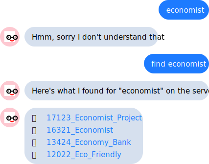

## Problem
At Signal Noise we have a server that contains all the files that are related to a project. These include design assets, proposal documents, contracts, copy and much more. All of this is organised into project folders which have a project number and name. In turn, all these project folders are contained in year folders.

*It's a little bit painful to watch and experience.*

As the company has got bigger and more people work on different projects at once it has become hard for people to find the project they are looking for. Most people will remember the project number but sometimes people deal with multiple ongoing projects at once. People resort scrolling through a huge list in the Finder.

## Limitations
The ideal solution was to somehow index the server. However, without access to servers configuration panel, there is no way to do this. Furthermore, even if I can convince someone to start an index, it may take weeks or months to be usable. Most people would be happy for project folders to be searchable and not the files within.

The solution also had to be as “frictionless” to use as possible. From what I’ve observed throughout the years is that people don’t install apps, people don’t remember web addresses and we are all very reluctant to doing things in new ways. With these 3 points in mind, it could not be an app. Maybe it could be a website but no one will remember the URL. And if there were a way to implement it into spotlight search, not everyone will change their workflow to press command + space now and then.

## Solutions
Slack was the chosen platform for the solution thanks to a suggestion from a colleague. Slack made sense because it is already part of the work-flow for pretty much everyone in the office (except like, 1 person who stays away from it). This is the lowest barrier to entry that isn't directly searching via the Finder.

## My Role
### Getting things started
Within a few days, I got a chatbot on Slack up and running. I named the integration “snbot” with the vision that it would become an assistant for all things Signal Noise related. More on my grand vision later.

I had heard about a Node.js framework called Botkit that assisted in the creation of bots for various chat services. So I gave it a try and it was very easy to get started with. You can define phrases using strings or regex that Botkit can “listen” out for. Then when it hears something specific it can send a response back or start a conversation using the API it provides. I also created a very rudimentary indexer that used Node’s built in filesystem functions `fs` to scan project folders on the server using my computer. It would then save the scraped results to a JSON file.

Later that week I released snbot to the world (well, the office at least) and got instant feedback on its usefulness and flaws. Everyone who saw it thought it was a good idea. At this time the chatbot was running on my laptop. This meant that when my computer was off, snbot was down. While this gave the nice illusion that snbot lived a fulfilling 9 to 6 lifestyle, it wasn't useful being unavailable occasionally. Deploying on my computer was always a temporary step to test out snbot. Next I need to find a way to keep it up 24/7.

I debated for a while if snbot should be hosted on a cloud service like AWS. While this would solve the chatbot uptime issue it introduced other problems. How would a server on AWS index the project server that was only accessible on the local network? And if it could somehow get to that data, transferring and storing it in the cloud is a potential security risk.

Anyway, Christmas came we all had a holiday. I ate lots of food and got a Raspberry Pi as a gift. Raspberry Pi 3 was ideal because it ran a Linux-based operating system, so most things that can work on AWS are compatible. It’s also a physical thing that we have full control over so security is better. Setting up the Raspberry Pi allowed me to get a lot more familiar with the internal workings of Linux. In turn, this helped me understand more how AWS works.

### Indexing the server
I spent a long time trying to get AFP ([Apple File Protocol](https://en.wikipedia.org/wiki/Apple_Filing_Protocol)) to work on the Raspberry Pi. I did find an apt package that allowed me to connect to the server via AFP but hit a dead end when it did not play nicely with the `fs` module.

The project stalled for a bit until I realised one day that our server is a Synology NAS and had an API. I spent a good while backward engineering it's API from a single PDF that Synology provided on their website. However, instead I ended up a [npm package](https://www.npmjs.com/package/synology) that someone else already created.
Using the API made indexing really simple. All that was required to do was call `GET` requests to specific folders and save the JSON result.

### Separating concerns
Up until this point, the snbot had been monolithic in structure. Project indexing, searching and chat bot interface were tightly coupled. While this allowed me to get things up and running quickly, it hindered further development.

*My technical diagram for monolithic architecture. Or what I like to call “a big thing doing a bunch of stuff inside of it”.*

So inspired by a [microservices talk by Netflix](https://www.youtube.com/watch?v=57UK46qfBLY), I refactored the code base to remove the tight coupling between chat interface and index searching. The project indexer and search became a separate Node app that provided a simple RESTful API. This would allow for future development of other interfaces or tools that interact with the project server searching.

*Separating concerns.*

With the searching separate it also meant that if the process of indexing the server changed in any way, as long as the API interface remained the same other apps relying on it won’t change.
It also made development easier because I could work on the indexer separately while the chatbot was still up and running.

The chatbot was released a second time with the updated features and a name change to “FindBot”. The name change signified the bots new single focus, finding things.

## Lessons learned
### Focus on a few things
I once heard about how climatologists study climate change’s effects they go to Antarctica. This sounds rather extreme to study something that affects the world globally, but they do it for two main reasons. The first is that Antarctic ecosystems are very primitive so they are easier to measure and study. Secondly, it is very isolated, so you can observe changes over time and assume they are down to global factors.

FindBot allowed me to study user behavior with a very limited feature set. Just one feature really, search. I could assume that any problems people were having with the app were to do with search failing them.

On the technical side of things, I learned more about separating concerns. This comes back to doing one thing and doing it well. Having two Node applications each focused on one task really helped with the design of the application structure.

### Assumptions vs evidence
A lot of assumptions you make about the user will be wrong. Getting users to learn new things is an effort. And asking users to change their workflow is a bigger one. For example, originally the “find” command had to be used to start a search.

*Some users were not as forgiving and abandoned FindBot straight away.*

I got feedback from a few people who used FindBot frequently that typing the word “find” before every query wasn't inline with how they expected to use it.  I also saw from looking at the analytics a few individuals not returning to FindBot again once they received the “don't understand response”. This small design decision was chosen originally because I had the grand plan of adding a whole array of functionality that wasn't to do with search. However, this greatly affected the user experience and taught me to really focus on doing one thing and doing it well.
FindBot’s new features are now completely driven by seeing how people interact with it and talking about how they use it.

What's next for FindBot? Well, JIRA and BitBucket are still a hassle to search. And it's a requested feature among project managers. With Elasticsearch we can even do more relational searches. The plan for FindBot is to become a universal search for all things project related.

*It makes it all worthwhile when seeing users thank FindBot. Or maybe it’s a sign of human’s inevitable demise.*
